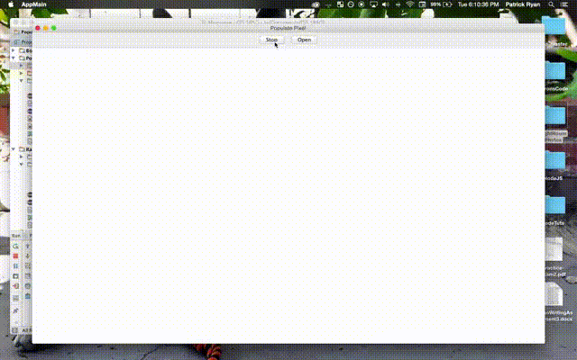

# Generated Dot Art

This program will pass in an image that the user chooses and generate an infinite of generations. Every pixel is moving within a certain range. It's not 100% accurate but the art that is produced has a really cool effect. 

